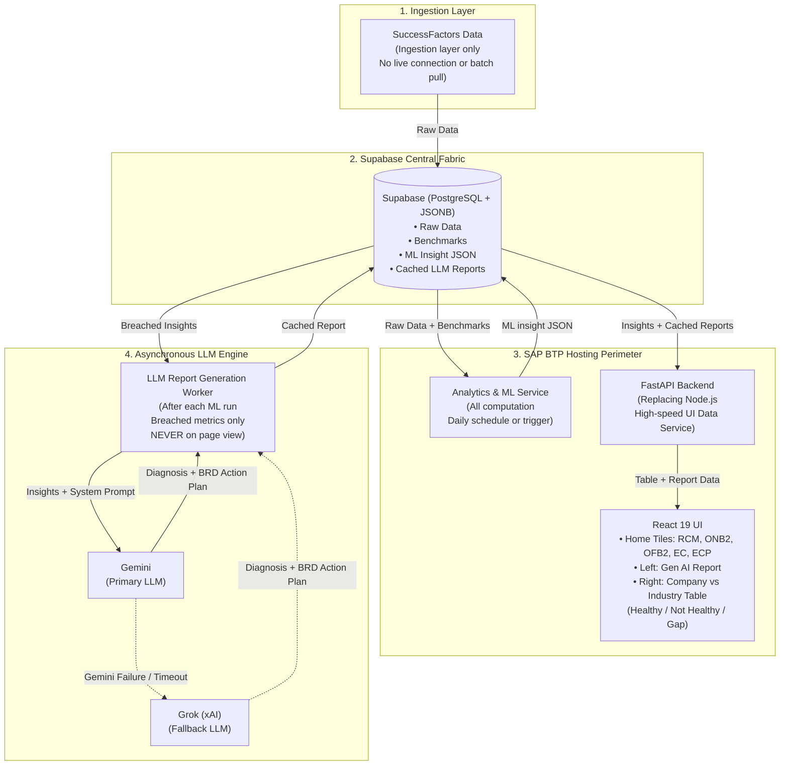

# SAP SuccessFactors Enterprise Health Monitoring System
## Comprehensive Backend Architecture & FastAPI Implementation Guide

**Target Audience:** Backend Engineer / FastAPI Developer / SAP BTP Architect  
**Architecture Source:** Enterprise Architecture Specification (Ref: Eraser Architecture Diagram)  
**Hosting Environment:** SAP Business Technology Platform (SAP BTP)  
**Core Stack:** SuccessFactors Ingestion ➔ Supabase ➔ SAP BTP (Analytics & ML + FastAPI + React UI) ➔ Gemini & Grok (LLM Fallback)

---

## 1. Executive Architecture Summary

The **SuccessFactors Health Monitoring System** is an enterprise-grade diagnostic platform that evaluates human capital operational health across 5 core SAP SuccessFactors modules:
1. **Employee Central (EC)**: Core biographical data accuracy, workflow approval latency, retroactive transactions, employee attrition.
2. **Employee Central Payroll (ECP)**: Payroll control center exceptions, retroactive payroll recalculations, wage type replication lag.
3. **Recruitment Management (RCM)**: Requisition aging, applicant-to-interview conversion, offer turnaround time.
4. **Onboarding 2.0 (ONB2)**: Pre-day-1 portal friction, IT/asset clearance latency, 30/60/90-day new hire review cadence.
5. **Offboarding 2.0 (OFB2)**: Revocation turnaround, IT/IAM de-provisioning delays, company asset recovery compliance.

---

## 2. End-to-End System Architecture (Eraser Diagram Alignment)



---

## 3. Core Architectural Pillars & Design Principles

### Pillar 1: Decoupled Ingestion Layer
* **SuccessFactors Data** is handled strictly through an ingestion pipeline (scheduled SFTP, OData delta export, or SAP Integration Suite).
* **Zero Live Pulls:** The end-user dashboard **never** queries the live SAP SuccessFactors tenant directly during user requests. This guarantees zero impact on ERP production performance and removes ERP API rate-limiting issues.

### Pillar 2: Supabase as the Central Data Hub
Supabase (PostgreSQL with JSONB) acts as the single source of truth across all 4 operational states:
1. **Raw Ingested Data:** Historical employee, requisition, workflow, and asset logs.
2. **Benchmark Standards:** Official SAP best-practice ranges and customer custom targets.
3. **ML Insight JSON:** Structured outputs from the Analytics & ML engine (TreeSHAP factors, stage/segment breach drivers).
4. **Cached LLM Reports:** Pre-computed executive diagnoses, impact assessments, and BRD action plans.

### Pillar 3: Analytics & ML on SAP BTP
* Runs inside SAP BTP as an automated cron job (daily schedule or webhook trigger).
* Reads `raw data + benchmarks` from Supabase.
* Computes dual variance, health classification (`Healthy`, `At Risk`, `Critical`), and TreeSHAP root-cause feature ranking.
* Writes structured `ML insight JSON` back to Supabase.

### Pillar 4: Asynchronous LLM Generation with Gemini ➔ Grok Fallback
> [!IMPORTANT]
> **Strict Lifecycle Rule:** *"After each ML run · breached metrics only · never on page view"*
* **Never Run LLMs on Page View:** Calling LLMs on frontend page load introduces 3–8 second latency, rate-limiting failures, and runaway token costs.
* **Pre-Computed Caching:** When the ML engine finishes, an asynchronous worker identifies **breached metrics only** (`status IN ('Critical', 'At Risk')`).
* **Multi-LLM Fallback Protocol:**
  1. **Primary LLM:** **Google Gemini** (Gemini 1.5 Pro / Flash) processes the insight JSON with strict JSON schema enforcement.
  2. **Fallback LLM:** If Gemini times out, experiences HTTP 429/503 errors, or fails JSON parsing, the worker automatically re-routes the prompt to **Grok (xAI)** via OpenAI-compatible API.
  3. The final structured BRD action plan is written back to Supabase as `cached report`.

### Pillar 5: FastAPI Backend on SAP BTP (Replacing Node.js)
* **Why FastAPI over Node.js:**
  - Native Python interoperability with the ML engine models, pandas, and data structures.
  - Pydantic v2 validation gives sub-millisecond serialization speeds.
  - Native async I/O handles concurrent dashboard queries seamlessly.
* **Ultra-Fast Performance (<50ms):** When the React UI requests dashboard tiles or deep dives, FastAPI reads pre-cached data from Supabase. The user experiences instant rendering with zero LLM waiting time.

---

## 4. Supabase Database Schema Contract

Execute the following DDL script in your Supabase SQL editor:

```sql
-- 1. Enable UUID Extension
CREATE EXTENSION IF NOT EXISTS "uuid-ossp";

-- 2. Modules Registry Table (5 Modules from Diagram)
CREATE TABLE sf_modules (
    id VARCHAR(32) PRIMARY KEY, -- 'ec', 'ecp', 'rcm', 'onb', 'ofb'
    name VARCHAR(128) NOT NULL,
    description TEXT,
    icon_type VARCHAR(64) DEFAULT 'users',
    icon_color VARCHAR(32) DEFAULT '#0284c7',
    status VARCHAR(32) DEFAULT 'At Risk', -- 'Healthy', 'At Risk', 'Critical'
    display_order INT DEFAULT 1,
    updated_at TIMESTAMP WITH TIME ZONE DEFAULT NOW()
);

-- Seed initial 5 modules
INSERT INTO sf_modules (id, name, description, icon_type, icon_color, status, display_order) VALUES
('ec', 'Employee Central', 'Core data accuracy, picklist governance, and workflow approval cycles.', 'users', '#0284c7', 'At Risk', 1),
('ecp', 'Employee Central Payroll', 'Payroll Control Center exceptions, wage-type replication, and retroactive recalc errors.', 'calculator', '#8b5cf6', 'Critical', 2),
('rcm', 'Recruitment (RCM)', 'Requisition aging, interview scheduling velocity, and applicant drop-offs.', 'briefcase', '#ec4899', 'Critical', 3),
('onb', 'Onboarding (ONB2)', 'Day-1 IT asset readiness, paperwork compliance, and 90-day ramp velocity.', 'user-plus', '#10b981', 'At Risk', 4),
('ofb', 'Offboarding (OFB2)', 'Hardware recovery compliance, asset reclamation, and access revocation turnaround.', 'user-minus', '#f97316', 'At Risk', 5)
ON CONFLICT (id) DO NOTHING;

-- 3. Metric Benchmarks Master Table
CREATE TABLE sf_metric_benchmarks (
    id UUID PRIMARY KEY DEFAULT uuid_generate_v4(),
    module_id VARCHAR(32) REFERENCES sf_modules(id) ON DELETE CASCADE,
    metric_code VARCHAR(64) UNIQUE NOT NULL,
    metric_name VARCHAR(256) NOT NULL,
    category VARCHAR(128) NOT NULL,
    company_value VARCHAR(64) NOT NULL,
    standard_value VARCHAR(64) NOT NULL,
    variance VARCHAR(64) NOT NULL,
    status VARCHAR(32) NOT NULL, -- 'Healthy', 'At Risk', 'Critical'
    unit VARCHAR(32) DEFAULT '%',
    evaluation_direction VARCHAR(32) DEFAULT 'LOWER_IS_BETTER',
    updated_at TIMESTAMP WITH TIME ZONE DEFAULT NOW()
);

-- 4. ML Insights Output Table (Written by Analytics & ML Pipeline)
CREATE TABLE ml_insights (
    id UUID PRIMARY KEY DEFAULT uuid_generate_v4(),
    metric_code VARCHAR(64) REFERENCES sf_metric_benchmarks(metric_code) ON DELETE CASCADE,
    execution_run_id VARCHAR(64) NOT NULL,
    execution_timestamp TIMESTAMP WITH TIME ZONE DEFAULT NOW(),
    health_state VARCHAR(32) NOT NULL, -- 'Healthy', 'At Risk', 'Critical'
    company_actual NUMERIC(10,2) NOT NULL,
    benchmark_target NUMERIC(10,2) NOT NULL,
    actual_variance NUMERIC(10,2) NOT NULL,
    variance_percentage NUMERIC(10,2) NOT NULL,
    stage_drivers JSONB NOT NULL DEFAULT '[]'::jsonb,
    segment_drivers JSONB NOT NULL DEFAULT '[]'::jsonb,
    trend_analysis JSONB NOT NULL DEFAULT '{}'::jsonb,
    shap_contributing_factors JSONB NOT NULL DEFAULT '[]'::jsonb,
    missing_configurations JSONB NOT NULL DEFAULT '[]'::jsonb,
    created_at TIMESTAMP WITH TIME ZONE DEFAULT NOW()
);

-- 5. Cached LLM Reports Table (Written by Async Worker: Gemini Primary, Grok Fallback)
CREATE TABLE llm_brd_reports (
    id UUID PRIMARY KEY DEFAULT uuid_generate_v4(),
    metric_code VARCHAR(64) REFERENCES sf_metric_benchmarks(metric_code) ON DELETE CASCADE,
    ml_insight_id UUID REFERENCES ml_insights(id) ON DELETE CASCADE,
    llm_provider VARCHAR(32) NOT NULL, -- 'gemini' | 'grok'
    diagnosis_narrative TEXT NOT NULL,
    impacted_touchpoints JSONB NOT NULL DEFAULT '[]'::jsonb,
    business_impact_narrative TEXT NOT NULL,
    specialist_manpower JSONB NOT NULL DEFAULT '[]'::jsonb,
    timeline_and_effort JSONB NOT NULL DEFAULT '{}'::jsonb,
    phased_activities JSONB NOT NULL DEFAULT '[]'::jsonb,
    execution_workstreams JSONB NOT NULL DEFAULT '[]'::jsonb,
    target_outcome TEXT NOT NULL,
    success_criteria JSONB NOT NULL DEFAULT '[]'::jsonb,
    assumptions_and_risks JSONB NOT NULL DEFAULT '[]'::jsonb,
    footnote TEXT,
    created_at TIMESTAMP WITH TIME ZONE DEFAULT NOW()
);

-- 6. Custom Customer Uploaded Standards
CREATE TABLE custom_standards (
    id UUID PRIMARY KEY DEFAULT uuid_generate_v4(),
    metric_code VARCHAR(64) NOT NULL,
    custom_target VARCHAR(64) NOT NULL,
    uploaded_by VARCHAR(128) DEFAULT 'enterprise_admin',
    created_at TIMESTAMP WITH TIME ZONE DEFAULT NOW()
);

-- 7. Ingestion Run Metadata Table
CREATE TABLE ingestion_runs (
    id UUID PRIMARY KEY DEFAULT uuid_generate_v4(),
    source_type VARCHAR(64) DEFAULT 'SAP_SF_EXTRACT',
    records_ingested INT DEFAULT 0,
    status VARCHAR(32) DEFAULT 'COMPLETED',
    started_at TIMESTAMP WITH TIME ZONE DEFAULT NOW(),
    completed_at TIMESTAMP WITH TIME ZONE DEFAULT NOW()
);
```

---

## 5. Dual LLM Implementation: Gemini Primary with Grok Fallback

Here is the production implementation of `app/services/llm_service.py` that implements the dual-provider fallback logic:

```python
# app/services/llm_service.py
import os
import json
import logging
import google.generativeai as genai
from openai import OpenAI
from typing import Tuple, Dict, Any

logger = logging.getLogger("sf_health.llm")

# Initialize Gemini Client
GEMINI_API_KEY = os.getenv("GEMINI_API_KEY")
if GEMINI_API_KEY:
    genai.configure(api_key=GEMINI_API_KEY)

# Initialize Grok Client (via OpenAI SDK pointing to xAI endpoint)
GROK_API_KEY = os.getenv("GROK_API_KEY")
grok_client = OpenAI(
    api_key=GROK_API_KEY or "missing",
    base_url="https://api.x.ai/v1"
)

SYSTEM_PROMPT = """
You are an Enterprise SAP SuccessFactors Solutions Architect.
Your task is to generate a comprehensive, structured Business Requirements Document (BRD) Plan of Action based on the provided ML diagnostic telemetry for a breached HR metric.

RULES:
1. Return ONLY valid, parseable JSON conforming strictly to the requested schema.
2. Author Section 2 (Diagnosis), Section 5 (Business Impact), Section 6 (BRD Plan with staffing), Section 7 (Execution Workstreams mapping to ML drivers S1, S2, A1), Section 8 (Success Criteria), and Section 9 (Assumptions & Risks).
"""

def generate_brd_with_fallback(ml_insight_json: Dict[str, Any]) -> Tuple[Dict[str, Any], str]:
    """
    Attempts generation with Gemini (Primary).
    On any exception (timeout, 429, JSON error), seamlessly falls back to Grok (Fallback).
    Returns (brd_data_dict, provider_name).
    """
    prompt = f"""
    {SYSTEM_PROMPT}

    ML INSIGHT TELEMETRY:
    {json.dumps(ml_insight_json, indent=2)}

    Generate the complete BRD schema JSON.
    """

    # 1. PRIMARY: Try Google Gemini
    try:
        logger.info(f"Attempting BRD generation via Primary LLM (Gemini) for metric: {ml_insight_json.get('metric_code')}")
        model = genai.GenerativeModel(
            model_name="gemini-1.5-pro",
            generation_config={"response_mime_type": "application/json", "temperature": 0.2}
        )
        response = model.generate_content(prompt)
        parsed = json.loads(response.text)
        return parsed, "gemini"
    except Exception as gemini_err:
        logger.warning(f"Primary LLM (Gemini) failed: {gemini_err}. Triggering Fallback LLM (Grok)...")

    # 2. FALLBACK: Try xAI Grok
    try:
        logger.info(f"Attempting BRD generation via Fallback LLM (Grok-2) for metric: {ml_insight_json.get('metric_code')}")
        completion = grok_client.chat.completions.create(
            model="grok-2-latest",
            messages=[
                {"role": "system", "content": SYSTEM_PROMPT},
                {"role": "user", "content": f"ML Insight:\n{json.dumps(ml_insight_json, indent=2)}\nReturn valid JSON only."}
            ],
            response_format={"type": "json_object"},
            temperature=0.2
        )
        content = completion.choices[0].message.content
        parsed = json.loads(content)
        return parsed, "grok"
    except Exception as grok_err:
        logger.error(f"Fallback LLM (Grok) also failed: {grok_err}")
        raise RuntimeError(f"Both Gemini and Grok failed to generate BRD report: {grok_err}")
```

---

## 6. Asynchronous Scheduled Worker: Pre-Computing Breached Metrics

This worker script implements the rule: **"After each ML run · breached metrics only · never on page view"**.

```python
# app/workers/llm_report_worker.py
import logging
from app.db.supabase_client import supabase
from app.services.llm_service import generate_brd_with_fallback

logger = logging.getLogger("sf_health.worker")

def process_breached_metrics_after_ml_run(execution_run_id: str):
    """
    Called immediately after the Analytics & ML service finishes writing insights.
    Identifies metrics in 'Critical' or 'At Risk' status and pre-caches BRD reports.
    """
    logger.info(f"Starting async LLM report generation for ML run {execution_run_id}")

    # 1. Fetch breached insights from this run
    insights_res = supabase.table("ml_insights") \
        .select("*") \
        .eq("execution_run_id", execution_run_id) \
        .in_("health_state", ["Critical", "At Risk"]) \
        .execute()

    breached_insights = insights_res.data or []
    logger.info(f"Found {len(breached_insights)} breached metrics needing LLM BRD reports.")

    for insight in breached_insights:
        metric_code = insight["metric_code"]
        
        # 2. Check if cached report already exists for this run
        existing = supabase.table("llm_brd_reports") \
            .select("id") \
            .eq("ml_insight_id", insight["id"]) \
            .execute()
            
        if existing.data:
            logger.info(f"Report already cached for metric {metric_code}. Skipping.")
            continue

        try:
            # 3. Call Primary (Gemini) with Fallback (Grok)
            brd_content, provider = generate_brd_with_fallback(insight)

            # 4. Save to Supabase as cached report
            supabase.table("llm_brd_reports").insert({
                "metric_code": metric_code,
                "ml_insight_id": insight["id"],
                "llm_provider": provider,
                "diagnosis_narrative": brd_content.get("diagnosis_narrative", ""),
                "impacted_touchpoints": brd_content.get("impacted_touchpoints", []),
                "business_impact_narrative": brd_content.get("business_impact_narrative", ""),
                "specialist_manpower": brd_content.get("specialist_manpower", []),
                "timeline_and_effort": brd_content.get("timeline_and_effort", {}),
                "phased_activities": brd_content.get("phased_activities", []),
                "execution_workstreams": brd_content.get("execution_workstreams", []),
                "target_outcome": brd_content.get("targetOutcome", ""),
                "success_criteria": brd_content.get("successCriteria", []),
                "assumptions_and_risks": brd_content.get("assumptionsAndRisks", []),
                "footnote": brd_content.get("footnote", "")
            }).execute()

            logger.info(f"Successfully cached BRD report for {metric_code} using {provider}.")
        except Exception as e:
            logger.error(f"Failed to generate report for {metric_code}: {e}")
```

---

## 7. FastAPI Backend Project Structure & Endpoints

### 7.1 Project Directory Structure
```
backend/
├── app/
│   ├── __init__.py
│   ├── main.py                     # FastAPI entry point, CORS, routers
│   ├── config.py                   # Pydantic BaseSettings (.env variables)
│   ├── db/
│   │   ├── __init__.py
│   │   └── supabase_client.py     # Supabase client singleton
│   ├── schemas/
│   │   ├── __init__.py
│   │   ├── module_schemas.py      # Module overview and tile models
│   │   ├── deepdive_schemas.py    # Deep dive & BRD payload models
│   │   └── standards_schemas.py   # Custom standards import models
│   ├── services/
│   │   ├── __init__.py
│   │   ├── llm_service.py         # Dual LLM generator (Gemini + Grok fallback)
│   │   └── health_calculator.py   # Dual variance & health status calculations
│   ├── workers/
│   │   ├── __init__.py
│   │   └── llm_report_worker.py   # Post-ML run asynchronous BRD pre-computation
│   └── routers/
│       ├── __init__.py
│       ├── modules.py             # GET /api/v1/modules (Home tiles)
│       ├── deepdive.py            # GET /api/v1/metrics/{code}/deep-dive
│       ├── standards.py           # POST /api/v1/standards/upload
│       └── pipeline.py            # POST /api/v1/pipeline/trigger-ml-run
├── Dockerfile                      # SAP BTP Kyma / Container deployment
├── manifest.yml                    # SAP BTP Cloud Foundry deployment descriptor
├── requirements.txt
└── .env
```

### 7.2 Complete Endpoint Specifications

#### 1. `GET /api/v1/modules`
Returns module tiles data for the Home screen (*Employee Central, EC Payroll, Recruitment, Onboarding, Offboarding*).
- **FastAPI Router (`app/routers/modules.py`)**:
```python
from fastapi import APIRouter
from app.db.supabase_client import supabase

router = APIRouter()

@router.get("")
def get_all_modules():
    modules = supabase.table("sf_modules").select("*").order("display_order").execute().data or []
    benchmarks = supabase.table("sf_metric_benchmarks").select("module_id, status").execute().data or []

    result = []
    for mod in modules:
        mod_metrics = [b for b in benchmarks if b["module_id"] == mod["id"]]
        critical_count = sum(1 for b in mod_metrics if b["status"] == "Critical")
        at_risk_count = sum(1 for b in mod_metrics if b["status"] == "At Risk")
        healthy_count = sum(1 for b in mod_metrics if b["status"] == "Healthy")
        
        result.append({
            "id": mod["id"],
            "name": mod["name"],
            "status": mod["status"],
            "iconType": mod["icon_type"],
            "iconColor": mod["icon_color"],
            "description": mod["description"],
            "benchmarksCount": len(mod_metrics),
            "criticalCount": critical_count,
            "atRiskCount": at_risk_count,
            "healthyCount": healthy_count
        })
    return result
```

#### 2. `GET /api/v1/metrics/{metric_code}/deep-dive`
Returns the complete 9-section diagnostic payload. **Because reports are pre-cached, response time is < 50ms.**
```python
from fastapi import APIRouter, HTTPException
from app.db.supabase_client import supabase

router = APIRouter()

@router.get("/{metric_code}/deep-dive")
def get_metric_deep_dive(metric_code: str):
    # 1. Fetch metric master record
    metric_res = supabase.table("sf_metric_benchmarks").select("*").eq("metric_code", metric_code).execute()
    if not metric_res.data:
        raise HTTPException(status_code=404, detail="Metric not found")
    metric = metric_res.data[0]

    # 2. Fetch latest ML insights
    ml_res = supabase.table("ml_insights").select("*").eq("metric_code", metric_code).order("created_at", desc=True).limit(1).execute()
    ml_data = ml_res.data[0] if ml_res.data else {}

    # 3. Read PRE-CACHED LLM BRD Report (Zero on-the-fly LLM latency!)
    brd_res = supabase.table("llm_brd_reports").select("*").eq("metric_code", metric_code).order("created_at", desc=True).limit(1).execute()
    brd_data = brd_res.data[0] if brd_res.data else {}

    return {
        "metric": {
            "metric": metric["metric_name"],
            "code": metric["metric_code"],
            "category": metric["category"],
            "company": metric["company_value"],
            "standard": metric["standard_value"],
            "status": metric["status"],
            "variance": metric["variance"],
            "detailedAnalysis": {
                "whyItHappens": brd_data.get("diagnosis_narrative", "Diagnostic pending next scheduled run."),
                "whereItHappens": "Impacted SuccessFactors sub-portlets",
                "trendAnalysis": ml_data.get("trend_analysis", {}),
                "howItEffects": brd_data.get("business_impact_narrative", "")
            }
        },
        "stageDrivers": ml_data.get("stage_drivers", []),
        "segmentDrivers": ml_data.get("segment_drivers", []),
        "touchpoints": brd_data.get("impacted_touchpoints", []),
        "brdPlan": {
            "specialistManpower": brd_data.get("specialist_manpower", []),
            "timelineAndEffort": brd_data.get("timeline_and_effort", {}),
            "phasedActivities": brd_data.get("phased_activities", []),
            "executionWorkstreams": brd_data.get("execution_workstreams", []),
            "targetOutcome": brd_data.get("target_outcome", ""),
            "successCriteria": brd_data.get("success_criteria", []),
            "assumptionsAndRisks": brd_data.get("assumptions_and_risks", []),
            "footnote": brd_data.get("footnote", "")
        },
        "meta": {
            "cached": True,
            "llmProvider": brd_data.get("llm_provider", "pre-computed")
        }
    }
```

---

## 8. SAP BTP Deployment Configuration

### 8.1 Cloud Foundry `manifest.yml`
```yaml
---
applications:
  - name: sf-health-fastapi-backend
    memory: 1024M
    instances: 2
    buildpacks:
      - python_buildpack
    command: uvicorn app.main:app --host 0.0.0.0 --port $PORT
    env:
      SUPABASE_URL: "https://your-project.supabase.co"
      SUPABASE_SERVICE_ROLE_KEY: "eyJhbGciOi..."
      GEMINI_API_KEY: "AIzaSy..."
      GROK_API_KEY: "xai-..."
```

---

## 9. Developer Checklist: Aligning with the Architecture

- [x] **FastAPI replaces Node.js:** FastAPI handles UI data serving with sub-50ms latency.
- [x] **Decoupled Ingestion:** SuccessFactors data ingested asynchronously; zero direct ERP API calls on user requests.
- [x] **Supabase as Hub:** Holds raw data, benchmarks, ML insights, and cached LLM reports.
- [x] **Scheduled ML Computation:** Analytics & ML runs on daily schedule/trigger inside SAP BTP.
- [x] **Never on Page View:** LLM generation runs **only** after ML runs, **only** for breached metrics, and is pre-cached.
- [x] **Gemini ➔ Grok Fallback:** Primary Gemini generation automatically falls back to xAI Grok on any error or timeout.
- [x] **5 Target Modules:** Covers Employee Central, EC Payroll, Recruitment (RCM), Onboarding (ONB2), and Offboarding (OFB2).
